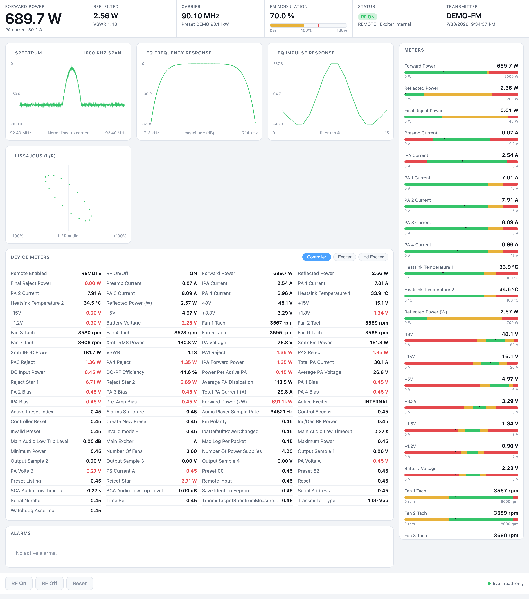

# Nautel transmitter web dashboard

A modern, browser-based replacement for the Flash AUI on Nautel FM transmitters. The original AUI is
a Shockwave/Flash application that no browser will run anymore.  For us Mac users, the NautelLegacyAccess.app
too is a workaround, but it is a Intel-only binary that will stop working in the next macOS release.

We've been promised a new HTML5 AUI "next year" for probably a decade now.  I got tired of waiting, so I wrote 
this.

This reads the same live telemetry off the transmitter's binary protocol and renders it as a 
dependency-free web page.  It currently has no "write" capability, so it cannot change any settings or 
turn the transmitter on/off.  As soon as I get my spare transmitter out of storage I plan to capture the 
write commands and add that functionality, but for now it is read-only.  

I tested this against a live on-the-air Nautel VS1 running firmware 5.3.2.1 and nothing bad happened.  It should
work with any Nautel FM transmitter that speaks the same protocol.  If your transmitter is not supported,
or it crashes, please let me know, and also send a packet capture so I can fix it.  Sorry in advance.  

> **Unofficial project.** Not affiliated with, authorized by, or endorsed by Nautel. "Nautel" and "AUI"
> are trademarks of their respective owner and are used here only to describe compatibility.



*The dashboard running on synthetic `--demo` data — no transmitter attached.*

Everything here was reverse-engineered from a packet capture plus the transmitter's own config files
retrieved over HTTP. There is no vendor documentation involved. See [docs/PROTOCOL.md](docs/PROTOCOL.md) 
for the protocol details.

## What it shows

- **Header** — forward/reflected power, VSWR, carrier frequency, FM modulation, RF and local/remote
  state, active exciter, plus the station's call sign and current preset. All of it comes from the
  transmitter; nothing is hard-coded per site, so the same page works for any unit.
- **Instrument plots** — RF spectrum with the regulatory mask overlay, EQ frequency and impulse
  response, and an L/R Lissajous (needs some work), decoded from the transmitter's array channels.
- **Meter rail** — every meter with the green/yellow/red threshold bands and range taken from the
  transmitter's spec, coloured exactly as the AUI does.
- **Device tables** — the full per-device meter list (Controller, Exciter, and HD Exciter when
  present), with out-of-range values flagged.

## Requirements

- **Python 3** — standard library only, no packages to install. The HTTP and WebSocket server is
  hand-rolled.
- **[tshark](https://www.wireshark.org/)** (the Wireshark CLI) — only needed for replay mode.

## Running it

Open <http://localhost:8531/> after starting any of these.

**Live, against a transmitter** (fetches the channel spec from it over HTTP automatically):

```bash
python3 nautel_bridge.py --host 192.168.10.1
```

With a login — the password rides in the handshake and is not echoed to the terminal:

```bash
python3 nautel_bridge.py --host 192.168.10.1 --user admin --password secret
NAUTEL_PASSWORD=secret python3 nautel_bridge.py --host 192.168.10.1
```

**Demo mode** — synthetic data, nothing attached. This is what the screenshot above shows:

```bash
python3 nautel_bridge.py --demo --spec-host 192.168.10.1
```

**Replay a capture** — decodes real recorded traffic at its original pace (`--speed` to accelerate):

```bash
python3 nautel_bridge.py --replay nautel.pcapng --spec-host 192.168.10.1 --speed 20
```

Demo and replay both need the transmitter's channel spec. Live mode fetches it automatically;
`--demo`/`--replay` get it from `--spec-host <transmitter>`, which is fetched once and cached to
`.tx_spec.cache.xml` so later runs work offline. (`--spec <file>` still accepts a local copy if you
have one.)

**Check credentials without launching the UI** — runs just the handshake and reports the result:

```bash
python3 nautel_bridge.py --host 192.168.10.1 --user admin --password secret --probe
```

## Read-only

This monitors; it cannot control. The captured protocol contains no write operations, so the command
encoding is unknown and the RF On/Off/Reset buttons are deliberately disabled. Adding control would
require capturing an AUI session that actually changes a setting, then working out the write frames.

One caveat worth knowing: the transmitter acknowledges the account selection regardless of the
password at this socket layer — a wrong or empty password is not rejected here. So `--probe` confirms
the socket works and the account exists, not that the password is correct. Password enforcement
appears to gate privileged operations, which aren't implemented.

## Files

| File | Purpose |
|------|---------|
| `nautel_bridge.py` | Protocol client, telemetry decoders, and the web server |
| `aui.html` | The dashboard (single file, no dependencies) |
| `chart.html` | A simpler channel-picker + trend page, served at `/chart` |
| `nautel3501.py` | Standalone offline tool that dumps a capture's frames, decoded and named |
| `tx_spec.xml` | The transmitter's channel definitions (units, scaling, thresholds) |
| `labels.json` | Channel display names extracted from the original Flash app |
| `docs/PROTOCOL.md` | The reverse-engineered TCP/3501 protocol reference |
